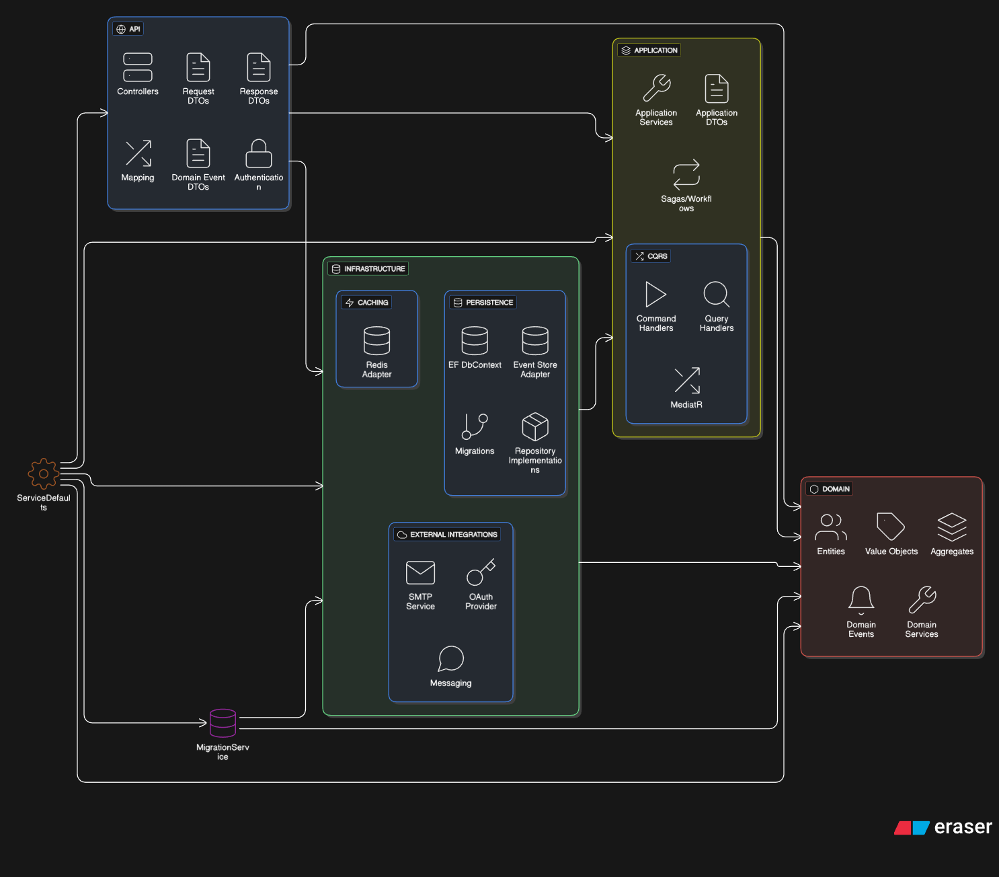

# OffroadCamping.Appointments

A microservice-based appointments API for OffroadCamping. This repository contains multiple projects (API, Application, Infrastructure, ServiceDefaults / Aspire helpers, and a MigrationService) and includes defaults for service discovery, resilience, health checks, OpenTelemetry, and authentication.



## Requirements

- .NET 10 SDK
- C# 14
- A supported IDE (for example, Visual Studio 2026) or the .NET CLI
- (Optional) Redis (for distributed cache) 
- (Optional) SQL databases for Appointments and Identity
- (Optional) KurrentDB or another event store for event sourcing

## Projects of interest

- `OffroadCamping.Appointments.API` — ASP.NET Core Web API (Program entry).
- `OffroadCamping.Appointments.Application` — Application layer (MediatR handlers, DTOs).
- `OffroadCamping.Appointments.Infrastructure` — Data access, services (AuthService), DI registrations.
- `OffroadCamping.Appointments.Domain` - Domain entities and domain events.
- `OffroadCamping.Appointments.SharedKernel` - Shared dependencies such as validation rules and system clock.
- `OffroadCamping.Appointments.ServiceDefaults` — Aspire service defaults (service discovery, OpenTelemetry, healthchecks). This project contains the user secrets used for local development.
- `OffroadCamping.Appointments.MigrationService` — Background service that applies EF Core migrations at startup.

## Architecture & Design Patterns

This solution is intentionally structured to demonstrate several modern architectural and design patterns:

- Event Sourcing via KurrentDB: The project demonstrates an event-sourced approach for recording domain events and persisting state via an event store. This enables an auditable append-only log of changes, replayability, and simplified integration with event-driven systems.
- Mediator pattern (MediatR): The Application layer uses MediatR to implement the mediator pattern for command and query dispatch, keeping handlers small and focused and decoupling business logic from controllers.
- Redis Cache-Aside pattern: Redis is used as a distributed cache with the cache-aside strategy. Application code populates and invalidates the cache explicitly, improving read performance while keeping the source of truth in the database.
- CQRS (Command Query Responsibility Segregation): The project separates write operations (commands) and read operations (queries) in the Application layer, enabling independent scaling and clearer intent for modifications versus reads.
- SOLID Principles: The codebase follows SOLID design principles to promote maintainability, testability, and clean separation of concerns across layers (API, Application, Infrastructure).

Purpose

The repository's primary purpose is to serve as a reference and demonstration of these patterns working together in a .NET 10 microservice. Use it as a learning tool or a starting point for production projects after applying hardened security, configuration, and operational practices.

## Running locally

1. Ensure the required databases and Redis are available and reachable.
2. Update the local user secrets (see the next section).
3. From the solution root run:
   - Using the .NET CLI:
     - `dotnet build`
     - `dotnet run --project OffroadCamping.Appointments.AppHost`
   - Or run the solution from Visual Studio.

The API exposes health endpoints and OpenAPI in development. Health endpoints are mapped by `MapDefaultEndpoints()` and are enabled in Development only.

## Aspire project: Update user secrets (REQUIRED)

This repository uses the Aspire/service-defaults project to centralize local secrets used in development. Before running the application locally you MUST update the user secrets for the `OffroadCamping.Appointments.ServiceDefaults` project with the keys below.

Required keys (examples and purpose):

- `AppSettings:Token` — JWT signing secret used by the authentication service.
- `AppSettings:Issuer` — JWT token issuer.
- `AppSettings:Audience` — JWT token audience.
- `ConnectionStrings:kurrentdb` — Event store / message db connection string.
- `ConnectionStrings:AppointmentsDb` — Appointments database connection string.
- `ConnectionStrings:IdentityDb` — Identity / Users database connection string.
- `cache` — Redis connection string used by `AddStackExchangeRedisCache`.
- `OTEL_EXPORTER_OTLP_ENDPOINT` (optional) — OpenTelemetry OTLP exporter endpoint.
- `APPLICATIONINSIGHTS_CONNECTION_STRING` (optional) — Azure Monitor / Application Insights connection string.

How to update user secrets

- Visual Studio:
  - Right-click the `OffroadCamping.Appointments.AppHost` project in Solution Explorer and choose __Manage User Secrets__. Add or update the keys in the displayed `secrets.json`.

- .NET CLI (from the repository root). Example commands:
  - Set the JWT signing secret:
    ```bash
    dotnet user-secrets set "AppSettings:Token" "your_jwt_secret" --project OffroadCamping.Appointments.ServiceDefaults/OffroadCamping.Appointments.ServiceDefaults.csproj
    ```
  - Set a connection string:
    ```bash
    dotnet user-secrets set "ConnectionStrings:AppointmentsDb" "Server=.;Database=Appointments;Trusted_Connection=True;" --project OffroadCamping.Appointments.ServiceDefaults/OffroadCamping.Appointments.ServiceDefaults.csproj
    ```
  - Set Redis cache endpoint:
    ```bash
    dotnet user-secrets set "cache" "localhost:6379" --project OffroadCamping.Appointments.ServiceDefaults/OffroadCamping.Appointments.ServiceDefaults.csproj
    ```

Notes
- Do NOT commit `secrets.json` or any sensitive values to source control.
- For CI/CD and production use environment-specific secret stores (Azure Key Vault, GitHub Actions secrets, environment variables, etc.). The ServiceDefaults project reads environment variables such as `OTEL_EXPORTER_OTLP_ENDPOINT` and `APPLICATIONINSIGHTS_CONNECTION_STRING` to enable exporters.
- Health check endpoints are enabled only in Development by default. Review the security implications before exposing them in non-development environments.

## Database migrations

- Migrations are applied by the `MigrationService` background worker. You can run that project to apply migrations automatically:
  - `dotnet run --project OffroadCamping.Appointments.MigrationService`
- Alternatively, apply migrations with `dotnet ef` tools against the corresponding DbContext projects.

## Telemetry and observability

OpenTelemetry is configured in the `ServiceDefaults` project. By default the solution adds ASP.NET Core, HTTP client, and runtime instrumentation. Configure exporters via environment variables or user secrets:
- `OTEL_EXPORTER_OTLP_ENDPOINT` — OTLP endpoint
- `APPLICATIONINSIGHTS_CONNECTION_STRING` — Azure Monitor

## Authentication

JWT authentication is used. Configure `AppSettings:Token`, `AppSettings:Issuer` and `AppSettings:Audience` in user secrets or environment variables.

## Contributing

Follow the repository's coding standards, style rules, and the included `.editorconfig` and `CONTRIBUTING.md` (when present). Keep secrets out of commits.

## Troubleshooting

- If the API fails to connect to a database, verify the connection strings in user secrets.
- For telemetry not exporting, confirm exporter environment variables are set and reachable.
